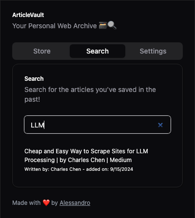

# ArticleVault: Your Personal Web Archive 🗃️🔍

[](https://opensource.org/licenses/MIT)
[](https://www.plasmo.com/)
[](https://reactjs.org/)
[](https://tailwindcss.com/)
[](https://ui.shadcn.com/)



ArticleVault is a powerful Chrome extension that transforms how you save and search through web content. Built with cutting-edge technologies, it offers a seamless experience for archiving and retrieving your favorite articles and blog posts.

## 🚀 Features

- **Effortless Scraping**: Save articles and blog posts with a single click
- **Intelligent Search**: Utilize hybrid vector + full-text search powered by OramaSearch
- **Sleek UI**: Enjoy a modern, responsive interface built with React and Tailwind CSS

## 🛠️ Tech Stack

- [Plasmo](https://www.plasmo.com/): The framework for building browser extensions
- [React](https://reactjs.org/): For building dynamic user interfaces
- [Tailwind CSS](https://tailwindcss.com/): For rapid, utility-first styling
- [shadcn/ui](https://ui.shadcn.com/): For beautiful, accessible UI components
- [OramaSearch](https://oramasearch.com/): For powerful, hybrid search capabilities

## 📦 Installation

1. Clone the repository:
   ```
   git clone https://github.com/alessandrocentanni/article-vault
   ```
2. Navigate to the project directory:
   ```
   cd article-vault
   ```
3. Install dependencies:
   ```
   npm install
   ```
4. Build the extension:
   ```
   npm run build
   ```
5. Load the extension in Chrome:
   - Open `chrome://extensions/`
   - Enable "Developer mode"
   - Click "Load unpacked"
   - Select the `build` folder in your project directory

## 🔍 OramaSearch Setup

To use ArticleVault, you need to set up an OramaSearch index with the correct schema. Follow these steps:

1. Create a new index in your OramaSearch dashboard
2. Use the following schema for your index:

```json
{
  "url": "string",
  "title": "string",
  "author": "string",
  "content": "string",
  "created_at": "string",
  "description": "string"
}
```

3. Make sure to enable full-text search for the `content` field
4. For better search results, you may want to enable vector search on relevant fields like `title`, `author`, and `description`

This schema allows ArticleVault to store and search through your saved articles efficiently. Each field serves a specific purpose:

- `url`: The web address of the saved article
- `title`: The title of the article
- `content`: The raw text content scraped from the article
- `created_at`: Timestamp of when the article was saved
- `author`: The author of the article (if available, taken from metadata)
- `description`: A brief description or summary of the article (if available, taken from metadata)

## ⚙️ Configuration

After installing the extension, you need to configure your OramaSearch credentials:

1. Click on the ArticleVault icon in your Chrome toolbar to open the extension
2. Navigate to the "Settings" tab in the extension's UI
3. You will see a form where you can enter the following OramaSearch information:
   - Secret Key
   - Public Key
   - Endpoint URL
   - Index ID
4. Enter the credentials from your OramaSearch dashboard
5. Save your settings

These settings are crucial for the proper functioning of ArticleVault's search capabilities. Make sure to keep your secret key confidential.

## 🖥️ Usage

1. Click the ArticleVault icon in your Chrome toolbar
2. To save an article, click the "Save" button while on the page
3. To search your saved articles, use the search bar in the extension popup
4. Enjoy quick access to your personal web archive!

## 🤝 Contributing

Contributions are welcome! Feel free to open an issue or submit a pull request. For major changes, please open an issue first to discuss what you would like to change.

## 📄 License

This project is licensed under the MIT License - see the [LICENSE](LICENSE) file for details.

## 🙏 Acknowledgements

- [Plasmo](https://www.plasmo.com/) for making extension development a breeze
- [OramaSearch](https://oramasearch.com/) for powering our search functionality
